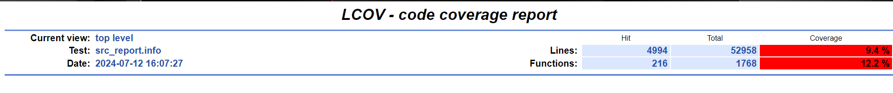
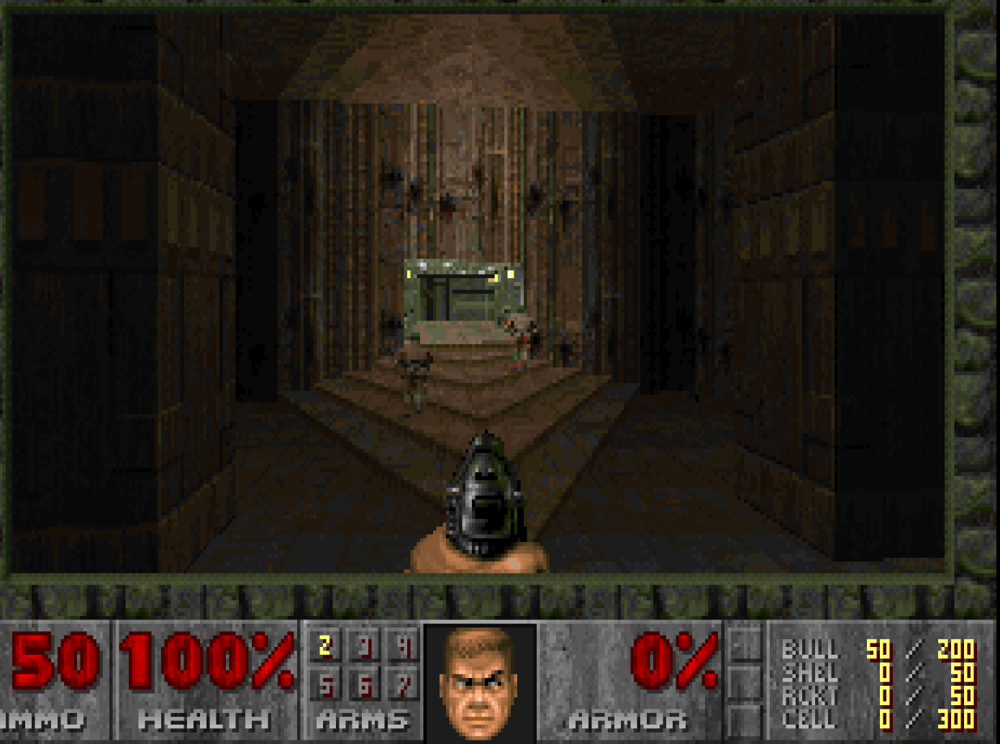

# REPORT

## Personal Information

- Student Name: Devansh Kansara
- Student ID: 21112551
- WatID: dpkansar

## What have been done to compile and run the code

Primarily, all the steps mentioned on the github has been followed to run the code

1. Pulling the docker file
2. Starting the container, with the local name FuzzDoom

Since my computer has windows operating system, the fuzzer was run using the command:

```bash
docker run -dit --name FuzzDoom uwstqam/fuzz-doom
```

3. Accessig the docker environment using

```bash
docker exec -it FuzzDoom /bin/bash
```

4. Build the Chocolate-Doom and the fuzzing-target
5. Generate the coverage report

In order to get the coverage report from the docker environment to my local computer, I have used the following command:

```bash
docker cp FuzzDoom:/home/doom/stqam/fb/build/html_output docker_html_out
```

## What have been done to increase the coverage

- I tried to download multiple .wad files from the internet but it did not result into anything significant.

- I then, examined the files p_setup.c and w_wad.c and the functions from these file were called directly from the fuzz_target file. Also, while I was looking at the w_wad.c file, I noticed that some sections of the code requires the first character of the file name being '~' and the file extension to be not .wad. Hence, I generated a file named "~fuzzzzz.wa" to cover specific sections of the code. This way I managed to increase the code coverage for these files - p_setup.c went to 82.3% and w_wad.c reached 84.4%.


By doing this, I was able to increase the coverage of only these above two mentioned files and the top-level coverage went to 9%.


## What bugs have been found? Can you replay the bug with chocolate-doom, not with the fuzz target?

I was not able to find any bugs during the fuzzing.

## Did you manage to compile the game and play it on your local machine (Not inside Docker)?

Yes I managed to compile and run the game on my local machine

